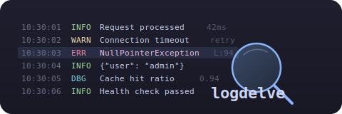

<p align="center">
  
</p>

<p align="center">
  <a href="https://pypi.org/project/logdelve/"></a>
  <a href="https://pypi.org/project/logdelve/"></a>
  
  <a href="https://pypi.org/project/logdelve/"></a>
  <br>
  <a href="https://github.com/chassing/logdelve/actions/workflows/ci.yml"></a>
  <a href="https://github.com/chassing/logdelve/actions/workflows/publish.yml"></a>
  <a href="https://github.com/astral-sh/ruff"></a>
  <a href="https://mypy-lang.org/"></a>
</p>

# logdelve

A terminal UI tool for viewing, filtering, and analyzing log lines. Built for outage investigation — find the needle in the haystack across thousands of log lines from multi-component applications.

## Features

- **Log level detection**: Automatic extraction from JSON fields and text patterns, color-coded line backgrounds
- **Component detection**: Kubernetes pods, Docker Compose services, JSON fields — with color-coded tags
- **Anomaly detection**: Baseline comparison to find log patterns that are new or changed (`--baseline`)
- **Message analysis**: Group log messages by event pattern, analyze JSON field value distributions
- **Search**: Forward/backward search with regex, case-sensitive options, and match highlighting
- **Interactive filtering**: Filter by text, regex, JSON key-value, or log level
- **Filter management**: Reorder, toggle, edit, delete, suspend/resume all filters with cursor preservation
- **Session management**: Save, load, rename, delete filter sessions with auto-save
- **Live tailing**: Follow growing log files in real-time with pause/resume
- **Flexible time parsing**: Natural language dates ("yesterday at 8am", "friday", "2 days ago")
- **Theme support**: Choose from all built-in Textual themes with persistent preference
- **AWS CloudWatch**: Download and list CloudWatch log groups, streams, and events with stream names

## Installation

Requires Python 3.13+.

```bash
# Install with uv
uv tool install logdelve

# Or install with pip
pip install logdelve

# With AWS CloudWatch support
pip install logdelve[aws]
```

## Quick Start

```bash
# View a log file
logdelve inspect app.log

# Pipe logs from kubectl
kubectl logs deploy/my-app --since=1h | logdelve inspect

# Download and view CloudWatch logs
logdelve cloudwatch get /aws/ecs/my-service prefix -s 1h | logdelve inspect

# Compare against a known-good baseline
logdelve inspect --baseline yesterday.log today.log
```

## Use Cases

### Outage Investigation with CloudWatch

```bash
# 1. Download baseline (yesterday, everything was fine)
logdelve cloudwatch get /aws/ecs/my-service "" \
  -s "yesterday 6:00" -e "yesterday 8:00" > baseline.log

# 2. Download current logs (outage happening now)
logdelve cloudwatch get /aws/ecs/my-service "" -s 1h > current.log

# 3. Compare — automatically shows only anomalous lines
logdelve inspect --baseline baseline.log current.log

# 4. In the TUI:
#    - Anomaly filter is auto-enabled (! to toggle off)
#    - Press 'a' to analyze message groups
#    - Press 'e' to filter by ERROR level
#    - Press 'x' to suspend all filters and see context around a line
```

### CloudWatch Log Download

```bash
# Flexible time formats
logdelve cloudwatch get /aws/ecs/my-service prefix -s "2 days ago"
logdelve cloudwatch get /aws/ecs/my-service prefix -s "friday" -e "saturday"
logdelve cloudwatch get /aws/ecs/my-service prefix -s "yesterday at 8am"
logdelve cloudwatch get /aws/ecs/my-service prefix -s 1h          # shorthand
logdelve cloudwatch get /aws/ecs/my-service prefix -s "Feb 13 2026 7:58"

# List available log groups and streams
logdelve cloudwatch groups /aws/ecs/
logdelve cloudwatch streams /aws/ecs/my-service

# Live tail CloudWatch logs
logdelve cloudwatch get /aws/ecs/my-service prefix --tail | logdelve inspect

# Each line includes [stream-name] prefix for component detection
```

### Analyzing Multi-Component Logs

```bash
# Pipe mixed logs from multiple pods
kubectl logs -l app=my-service --prefix --since=30m | logdelve inspect

# In the TUI:
#    - Component tags (·1, ·2) identify pods — press 'c' to see full names
#    - Press 'e' to filter by log level (ERROR → WARN → INFO)
#    - Press 'a' then 'm' to switch to field analysis mode
#    - Select a field value to filter (e.g., http_status: 500)
```

## Keybindings

### Search

| Key | Action                                                |
| --- | ----------------------------------------------------- |
| /   | Search forward (opens dialog with regex/case options) |
| ?   | Search backward                                       |
| n   | Next match                                            |
| N   | Previous match                                        |

### Navigation

| Key         | Action                    |
| ----------- | ------------------------- |
| Up / Down   | Move between log lines    |
| PgUp / PgDn | Page up / down            |
| Home / End  | Jump to first / last line |
| gg          | Jump to first line        |
| G           | Jump to last line         |

### Display

| Key   | Action                                            |
| ----- | ------------------------------------------------- |
| j     | Toggle pretty-print for ALL JSON lines            |
| Enter | Toggle pretty-print for the current line (sticky) |
| #     | Toggle line numbers                               |
| c     | Cycle component display (tag / full / off)        |

### Filtering

| Key | Action                                                |
| --- | ----------------------------------------------------- |
| f   | Filter in (text, key=value, or regex)                 |
| F   | Filter out (text, key=value, or regex)                |
| e   | Cycle log level filter (ALL / ERROR / WARN / INFO)    |
| !   | Toggle anomaly-only filter (with --baseline)          |
| x   | Suspend/resume all filters (preserves cursor position)|
| m   | Manage filters (toggle, edit, delete, clear, reorder) |
| 1-9 | Toggle individual filters on/off                      |

### Analysis

| Key | Action                                                |
| --- | ----------------------------------------------------- |
| a   | Analyze: message groups and field value distributions |

In the analyze dialog: `m` mode (messages/fields), `s` sort, `r` reverse, Enter to filter.

### Tailing

| Key | Action                            |
| --- | --------------------------------- |
| p   | Pause/resume tailing              |
| G   | Jump to bottom (follow new lines) |

### Sessions & General

| Key | Action                                       |
| --- | -------------------------------------------- |
| s   | Session manager (load, save, delete, rename) |
| t   | Select theme                                 |
| h   | Show help screen                             |
| q   | Quit                                         |

## Anomaly Detection

Compare current logs against a known-good baseline to find what changed:

```bash
logdelve inspect --baseline good-day.log bad-day.log
```

- Lines with **new message patterns** (not seen in baseline) are marked with a red `▌` indicator
- Anomaly filter is auto-enabled — press `!` to toggle between anomalies-only and all lines
- Press `x` to temporarily suspend all filters and see context around an anomalous line
- Use `a` (analyze) to see which message patterns are new

## Log Format

logdelve expects each line to begin with a timestamp, followed by either a JSON object or plain text:

```text
2024-01-15T10:30:00Z {"log_level": "info", "message": "Request processed", "duration_ms": 42}
2024-01-15T10:30:01Z Connection established from 192.168.1.1
Jan 15 10:30:02 myhost syslogd: restart
[pod-name-abc123] 2024-01-15T10:30:00Z {"event": "start", "level": "info"}
```

Lines without a recognized timestamp are displayed as-is. Component prefixes (`[pod-name]`, `service |`) are stripped before timestamp parsing.

## Sessions

Filter sessions are stored in `~/.config/logdelve/sessions/` as TOML files. Filters are auto-saved on every change. Use `--session` to load a session on startup.

## Configuration

Theme preference is stored in `~/.config/logdelve/config.toml`. Press `t` to open the theme selection dialog.

## Development

```bash
# Clone the repo
git clone https://github.com/chassing/logdelve.git
cd logdelve

# Install dependencies
uv sync

# Run from source
uv run logdelve inspect sample.log

# Run all checks (lint, format, typecheck, tests)
make test

# Individual targets
make lint        # ruff check
make format      # ruff format
make typecheck   # mypy
make clean       # remove caches

# Performance benchmark
uv run python scripts/perf_test.py
```

## Contributing

1. Fork the repo and create a feature branch
2. Install dependencies: `uv sync`
3. Make your changes
4. Run checks: `make test` (runs lint, format check, type check, and tests)
5. Submit a pull request

### Code style

- Python 3.13+ with type hints (strict mypy)
- Formatting and linting via [Ruff](https://github.com/astral-sh/ruff)
- Pydantic models for data structures
- Textual framework for the TUI

## Releasing

See `AGENT.md` for the full release checklist.

```bash
# After updating version + changelog + README:
git push
gh release create vX.Y.Z --title "vX.Y.Z" --notes "See CHANGELOG.md"
```

The `publish.yml` workflow builds and publishes to PyPI automatically. Requires `PYPI_TOKEN` secret in the GitHub repo settings.

## License

MIT
