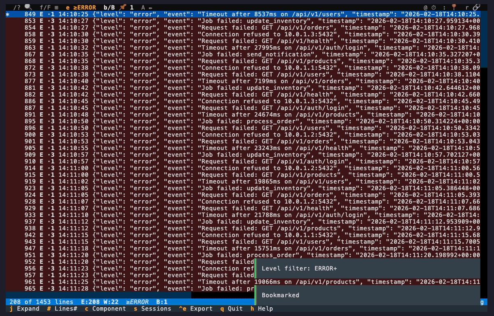
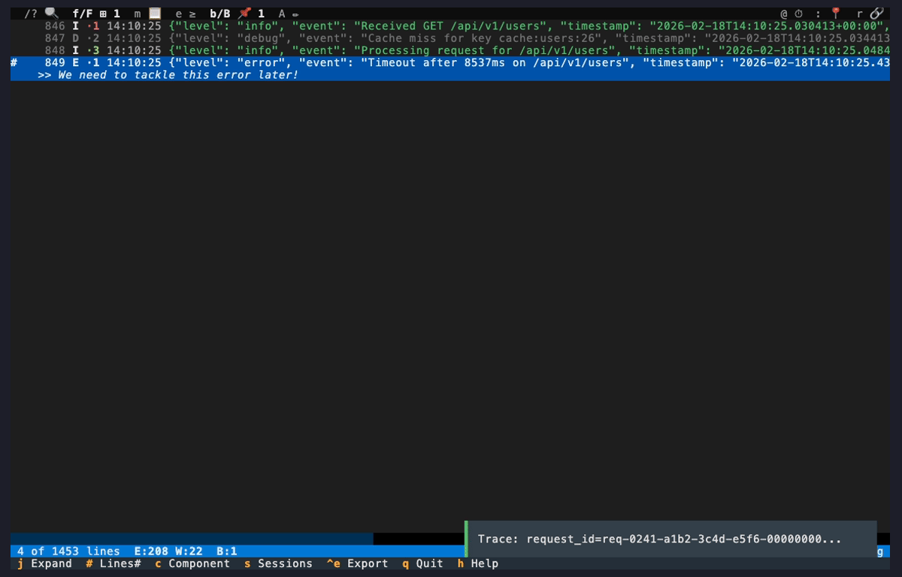
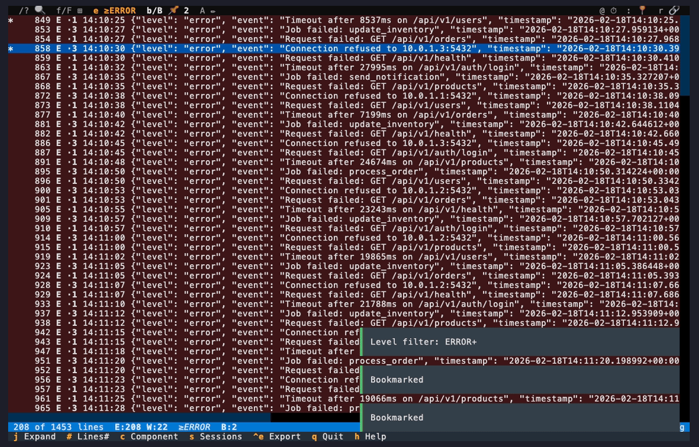

# Post-Mortem Documentation

The investigation is done. You've found the root cause -- a database connection pool exhaustion
causing cascading failures across three services. Now it's time to **document your findings**
for the post-mortem meeting, save your investigation setup, and export the evidence.

## Step 1: Bookmark Key Evidence


As you review the error lines, press `b` to bookmark the important ones. A yellow `*` marker
appears in the gutter. Bookmark the first error occurrence, the root cause line, and any other
key evidence.

Press `[` and `]` to jump between bookmarks. Press `B` to open the bookmark list and see all
your marked lines at a glance.

## Step 2: Annotate Your Findings



Press `A` on a bookmarked line to add an annotation. Type a note explaining what this line
means in the context of the incident -- for example: "Root cause: DB connection pool exhausted"
or "First ECONNREFUSED occurrence".

Annotations appear inline below the log line with a `#` marker. They help tell the story of
the incident when you come back to review later.

## Step 3: Save Your Investigation



Press `s` to open the session manager. Type a descriptive name like "incident-2026-02-18" and
press Enter to save your current filter setup, bookmarks, and annotations.

Next time you need to review this incident, launch logdelve with `--session`:

```bash
logdelve inspect --session incident-2026-02-18 /tmp/incident.log
```

All your filters and bookmarks are restored instantly. Share the session name with your team
so they can load it too (session files are stored in `~/.config/logdelve/sessions/`).

## Step 4: Export the Evidence



Press `Ctrl+E` to open the export dialog. Choose the scope:

- **Visible**: Export all currently filtered lines
- **All**: Export everything (unfiltered)
- **Bookmarked**: Export only the bookmarked lines with annotations

Select "Bookmarked" to export just the key evidence. The exported file contains the raw log
lines -- ready to paste into a post-mortem document, a Jira ticket, or share on Slack.

You can also export from the command line:

```bash
logdelve inspect --session incident-2026-02-18 --output evidence.log incident.log
```

## Key Commands Used

| Key      | Action                      | Learn More                                                 |
| -------- | --------------------------- | ---------------------------------------------------------- |
| `b`      | Toggle bookmark             | [Bookmarks & Annotations](../guide.md#bookmarks--annotations) |
| `B`      | List all bookmarks          | [Bookmarks & Annotations](../guide.md#bookmarks--annotations) |
| `A`      | Add/edit annotation         | [Bookmarks & Annotations](../guide.md#bookmarks--annotations) |
| `[` / `]`| Previous/next bookmark      | [Bookmarks & Annotations](../guide.md#bookmarks--annotations) |
| `s`      | Session manager             | [Sessions](../guide.md#sessions)                             |
| `Ctrl+E` | Export filtered results     | [Export](../guide.md#export)                                 |

## Next Steps

- [You Just Got Paged](you-just-got-paged.md) -- full multi-service outage investigation
- [What Changed? Baseline Comparison](what-changed.md) -- compare against a known-good baseline
