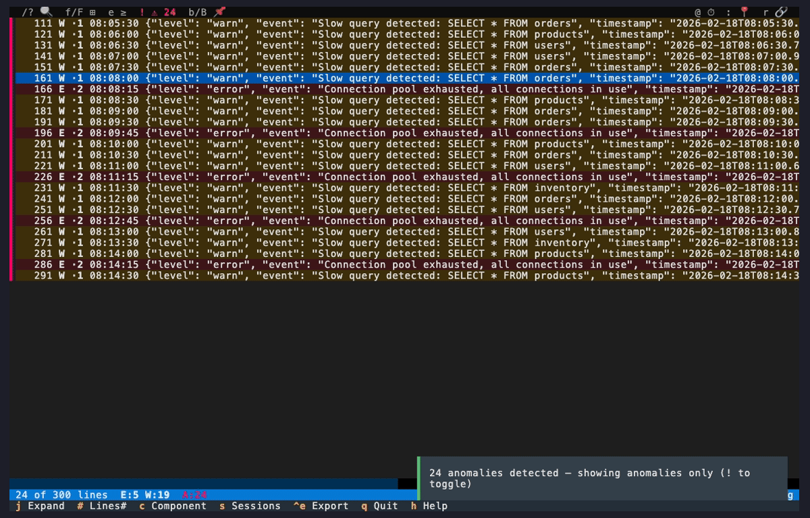
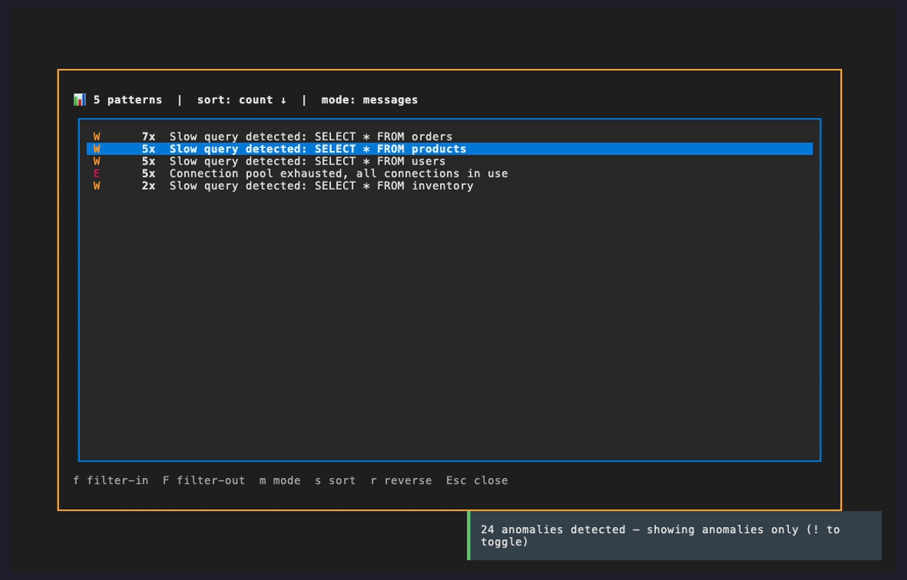

# What Changed? Baseline Comparison

Your application is slow. Users are complaining about increased response times. **You have
yesterday's logs from when everything was fine.** Compare them against today to find exactly
what changed.

## Create a Baseline

Save a copy of your logs from a known-good period:

```bash
# Download yesterday's logs as baseline
logdelve cloudwatch get /aws/ecs/my-service prefix \
  -s "yesterday 6:00" -e "yesterday 18:00" > baseline.log

# Download today's logs
logdelve cloudwatch get /aws/ecs/my-service prefix -s 2h > current.log

# Compare
logdelve inspect --baseline baseline.log current.log
```

## Step 1: Load with Baseline


When you launch with `--baseline`, logdelve extracts message templates from both files and
compares them. Templates that exist in the current logs but not in the baseline are flagged
as **anomalies**. The anomaly filter is automatically enabled.

The status bar shows `A:XX` -- the number of anomalous lines. Red `▌` markers appear on the
left edge of anomalous lines.

## Step 2: Spot the Anomalies



Scroll through the anomalous lines. You can see new patterns that didn't exist yesterday:
slow query warnings, connection pool exhaustion errors, memory pressure warnings.

Press `!` to toggle the anomaly filter off and see the full log context around these anomalies.
Press `!` again to return to the anomaly-only view.

## Step 3: Analyze the Changes


Press `a` to open the analysis dialog. logdelve shows all message templates grouped by pattern.
Novel templates -- patterns that only exist in today's logs -- stand out immediately.

Press `s` to sort by level and see the errors and warnings first. You can now see exactly which
new error patterns appeared today.

## Step 4: Drill Into the Pattern



Select a novel template like "Slow query detected" and press `f` to create a filter. Now
only the slow query lines are visible. Expand a line to see the full JSON with the query
details, duration, and affected table.

This immediately tells you what's causing the slowdown: specific database queries are taking
seconds instead of milliseconds.

## Step 5: Check Frequency Spikes


Clear the filter and press `a` again. Switch to **fields mode** with `m`. This shows the
distribution of field values across all log lines.

Here you can spot frequency spikes -- values that appeared rarely in the baseline but are now
common. For example, `http_status: 500` might have spiked from 0 to dozens of occurrences,
confirming the degradation is real.

## Key Commands Used

| Key | Action                          | Learn More                                         |
| --- | ------------------------------- | -------------------------------------------------- |
| `!` | Toggle anomaly-only filter      | [Anomaly Detection](../guide.md#anomaly-detection) |
| `a` | Analyze message patterns        | [Message Analysis](../guide.md#message-analysis)   |
| `s` | Sort analysis (count/level/key) | [Message Analysis](../guide.md#message-analysis)   |
| `m` | Toggle messages/fields mode     | [Fields mode](../guide.md#fields-mode)             |
| `x` | Suspend/resume all filters      | [Suspend / Resume](../guide.md#suspend--resume)    |

## How Anomaly Detection Works

logdelve normalizes each log message into a **template** by replacing variable parts
(IPs, UUIDs, timestamps, numbers, file paths) with tokens like `<IP>`, `<NUM>`, `<UUID>`.

Two types of anomalies are detected:

1. **Novel templates** (score 1.0): Patterns that exist in today's logs but not in the
   baseline at all. These are entirely new error types.

2. **Frequency spikes** (score 0.5): Patterns that existed in the baseline but appear
   more than 5x as often today. These indicate an existing issue that has worsened.

Learn more: [Anomaly Detection](../guide.md#anomaly-detection)

## Next Steps

- [You Just Got Paged](you-just-got-paged.md) -- full multi-service outage investigation
- [Post-Mortem Documentation](post-mortem.md) -- bookmark, annotate, and export your findings
