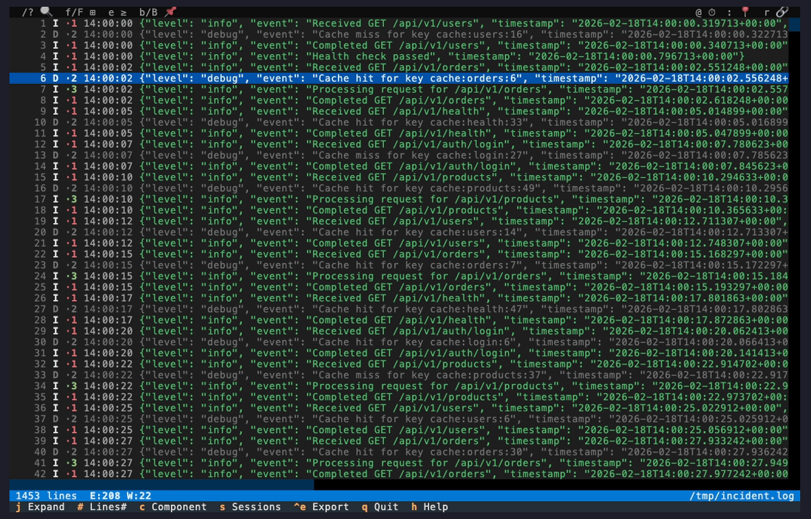
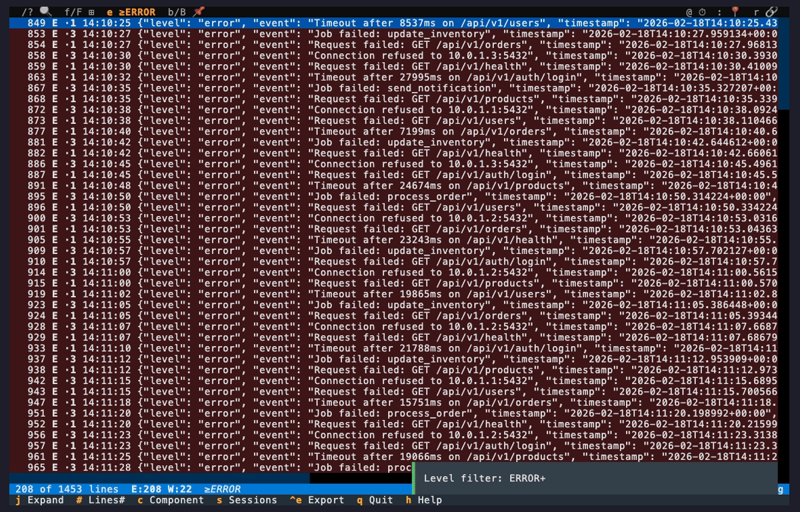
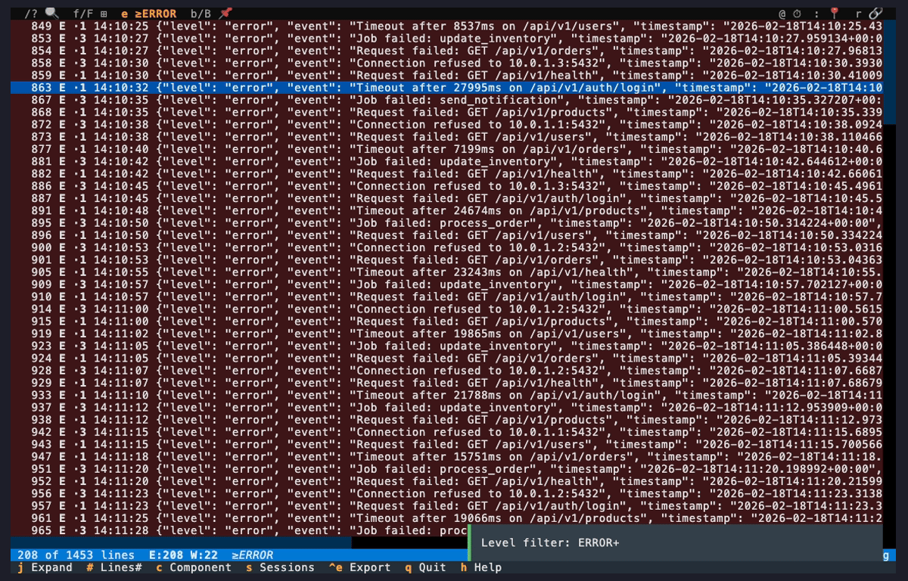
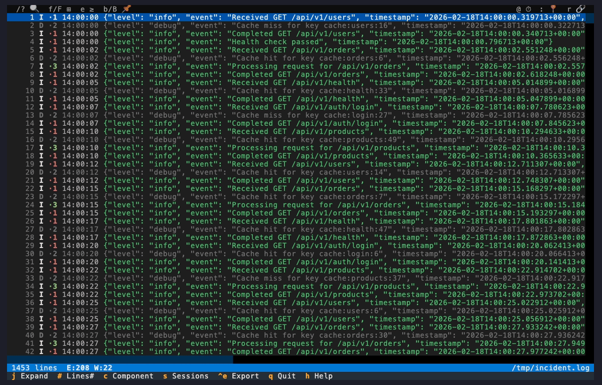

# You Just Got Paged

Your PagerDuty goes off: **"API error rate >5%, multiple 500s detected."**
Three services are affected. Time to investigate.

## Download the Logs

First, grab the CloudWatch logs for the affected services:

```bash
# Download the last hour of logs
logdelve cloudwatch get /aws/ecs/api-service api -s 1h > incident.log

# Or combine multiple service logs:
logdelve cloudwatch get /aws/ecs/api-service api -s 1h > api.log
logdelve cloudwatch get /aws/ecs/order-processor order -s 1h > worker.log
logdelve inspect api.log worker.log
```

## Step 1: Open the Incident Logs


logdelve merges all services chronologically and assigns each component a color-coded tag.
The status bar at the bottom shows the total line count along with `E:XX W:XX` -- the number
of error and warning lines at a glance. You can immediately see something is wrong.

## Step 2: Get Oriented



Press `c` to cycle the component display from compact tags (`·1`, `·2`) to full names like
`[api-server-7db64-a1b2c3]`. This helps identify which service each line comes from.

Press `Enter` to expand a single JSON line and see the full structured data. Press `j` to
expand all JSON lines at once -- useful for getting a quick overview of the field structure.

## Step 3: Find the Errors


Press `e` to cycle the log level filter to ERROR. All info and debug lines disappear, leaving
only the errors. The status bar confirms with a `>=ERROR` indicator.

Scrolling through the errors reveals a cluster of `ECONNREFUSED` and timeout messages -- the
database connection is failing.

## Step 4: What's Going Wrong?



Press `a` to open the message analysis dialog. logdelve groups all log lines by their message
template (variable parts like IPs, numbers, and UUIDs are normalized into tokens).

You can immediately see the dominant error pattern: `Connection refused to <IP>:<NUM>` with a
high count. Press `s` to sort by count and confirm. Select the group and press `Enter` to
create a filter matching those lines.

## Step 5: Trace a Failing Request



Navigate to an error line and press `r`. logdelve detects the `request_id` field and creates
a filter showing all log lines with the same request ID -- across all three services.

Now you can see the full lifecycle of a single failing request: it was received by the API
server, the cache was checked, the order processor tried to handle it, and then the database
connection failed. The root cause is clear.

Press `Enter` to expand a line and see the full JSON context with error details.

## Step 6: Narrow the Time Window



Press `@` to jump to a specific timestamp near the incident start. Then press `f` and switch
to the Time tab to set a precise start and end time. Now only the incident window is visible,
cutting out all the noise before and after.

This is useful for focusing the analysis on the exact period when things went wrong.

## Key Commands Used

| Key     | Action                              | Learn More                                                           |
| ------- | ----------------------------------- | -------------------------------------------------------------------- |
| `c`     | Cycle component display             | [Component Detection](../guide.md#component-detection)               |
| `Enter` | Expand/collapse JSON (current line) | [Display](../guide.md#display)                                       |
| `j`     | Expand/collapse JSON (all lines)    | [Display](../guide.md#display)                                       |
| `e`     | Cycle log level filter              | [Level filter](../guide.md#level-filter)                             |
| `a`     | Analyze message patterns            | [Message Analysis](../guide.md#message-analysis)                     |
| `r`     | Trace by request/trace ID           | [Trace ID correlation](../guide.md#trace-id-correlation)             |
| `@`     | Jump to timestamp                   | [Jump to Timestamp](../guide.md#jump-to-timestamp)                   |
| `f`     | Filter in (text/component/time)     | [Filtering](../guide.md#filtering)                                   |
| `:`     | Go to line number                   | [Navigation, Search & Display](../guide.md#navigation-search--display) |

## Next Steps

- [What Changed? Baseline Comparison](what-changed.md) -- compare against a known-good baseline
- [Post-Mortem Documentation](post-mortem.md) -- bookmark, annotate, and export your findings
