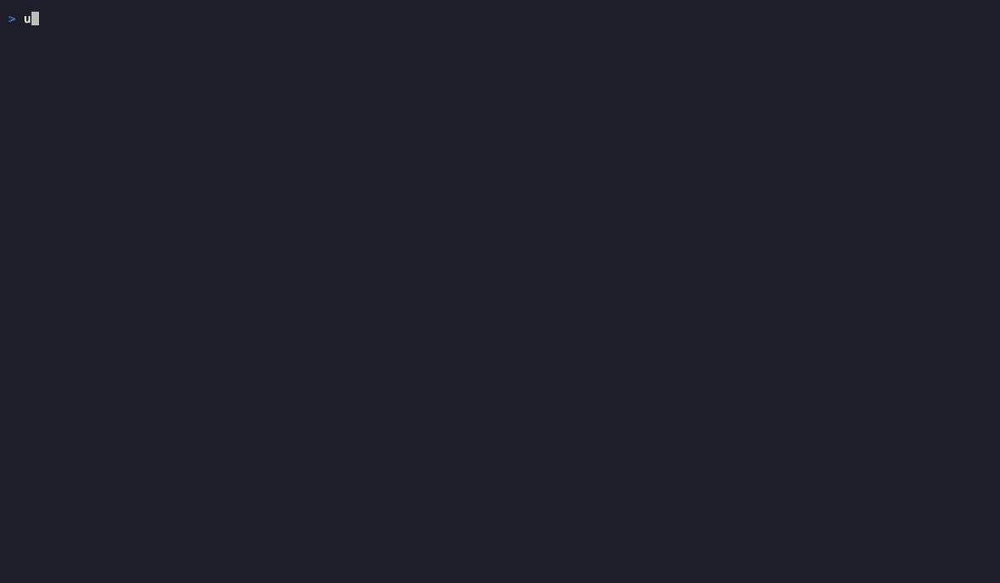
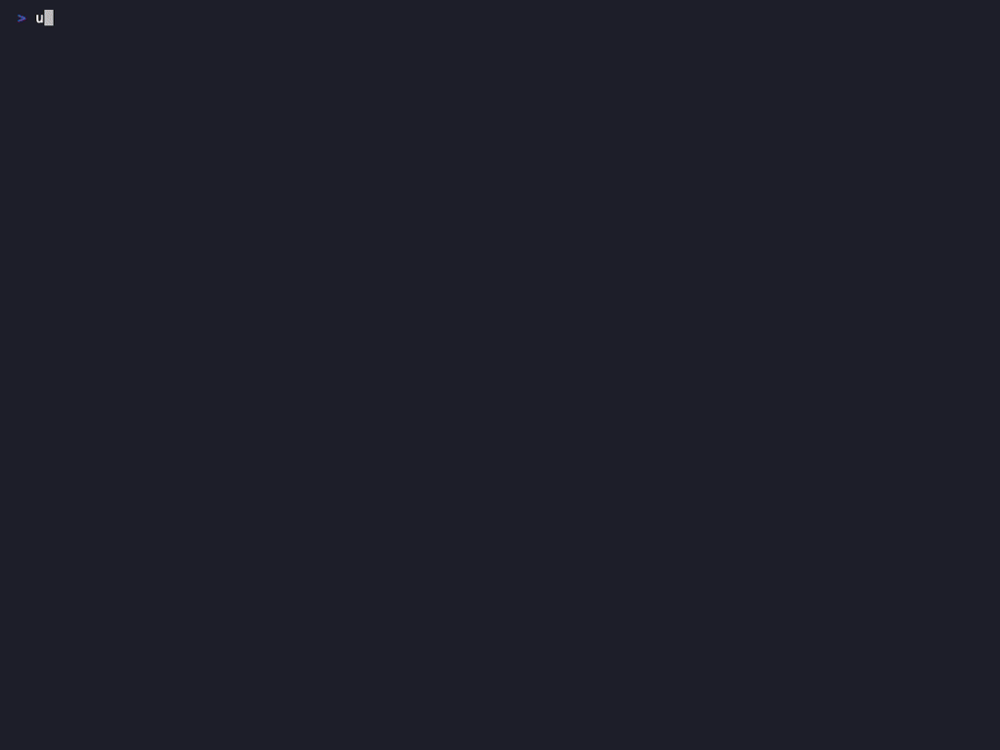

# logdelve User Guide

Complete documentation for all logdelve features. For a quick overview, see the [README](../README.md).

## Table of Contents

- [Getting Started](#getting-started)
- [First Steps](#first-steps)
- [Concepts](#concepts)
- [UI Layout](#ui-layout)
- [Log Level Detection](#log-level-detection)
- [Component Detection](#component-detection)
- [Supported Log Formats](#supported-log-formats)
- [Navigation & Display](#navigation--display)
- [Search](#search)
- [Filtering](#filtering)
- [Filter Management](#filter-management)
- [Message Analysis](#message-analysis)
- [Anomaly Detection](#anomaly-detection)
- [Sessions](#sessions)
- [Live Tailing](#live-tailing)
- [AWS CloudWatch](#aws-cloudwatch)
- [Time Parsing](#time-parsing)
- [Themes](#themes)
- [Large Files](#large-files)
- [Integration Patterns](#integration-patterns)
- [Troubleshooting](#troubleshooting)
- [Keyboard Reference](#keyboard-reference)

---

## Getting Started

```bash
# Install with uv (recommended)
uv tool install logdelve

# No uv? Install both in one step:
curl -LsSf uvx.sh/logdelve/install.sh | sh

# Alternative: pip
pip install logdelve

# With AWS CloudWatch support
uv tool install logdelve[aws]
```

```bash
# View a log file
logdelve inspect app.log

# Pipe from kubectl
kubectl logs deploy/my-app --since=1h | logdelve inspect

# Download and view CloudWatch logs
logdelve cloudwatch get /aws/ecs/my-service prefix -s 1h | logdelve inspect
```

---

## First Steps

A guided walkthrough to get productive quickly.

### 1. Open the sample log

```bash
logdelve inspect sample.log
```

You'll see the main TUI with three bars and a log view:

- **Toolbar** (top): Shows available shortcuts and active filter/search status
- **Log view** (center): Each line shows anomaly marker, level badge, component tag, timestamp, and content
- **Status bar**: Line counts, error/warning counts (`E:n W:n`), anomaly count (`A:n`), file name
- **Footer**: Session management, quit, help

### 2. Try these 5 things

1. **Navigate**: Use arrow keys (Up/Down) to move between lines, PgUp/PgDn to jump pages
2. **Search**: Press `/`, type `error`, press Enter — matches are highlighted, use `n`/`N` to jump between them
3. **Filter**: Press `f`, type a search term, press Enter — only matching lines are shown
4. **Expand JSON**: Press `j` to pretty-print all JSON lines, or Enter to expand just the current line
5. **Quit**: Press `q` to exit

### 3. Understanding the status bar

The status bar shows key counters at a glance:

```text
500 lines  E:12 W:3  A:2                                      app.log
```

- `500 lines`: Total number of visible lines (changes with active filters)
- `E:12`: 12 error-level lines in the file
- `W:3`: 3 warning-level lines
- `A:2`: 2 anomalous lines (only with `--baseline`)

### 4. Next steps

- Add more filters with `f` (include) and `F` (exclude) — see [Filtering](#filtering)
- Press `a` to analyze message patterns — see [Message Analysis](#message-analysis)
- Press `e` to filter by log level (cycle: ALL → ERROR → WARN → INFO)
- Press `x` to suspend all filters and see full context, `x` again to restore

---

## Concepts

Key terms used throughout this guide:

- **Log Line**: A single line of log output, parsed into timestamp + content (JSON or plain text) + metadata (level, component).
- **Component**: The source system, pod, or service that produced a log line. Extracted from bracket prefixes (`[pod-name]`), Docker Compose prefixes (`service |`), Kubernetes prefixes, syslog hostnames, or JSON fields (`service`, `component`, `app`, `source`, `container`, `pod`).
- **Template**: A normalized message pattern where variable parts (IPs, UUIDs, timestamps, numbers, paths) are replaced with tokens like `<IP>`, `<NUM>`, `<UUID>`, `<PATH>`, `<TS>`, `<HEX>`, `<STR>`. Used for grouping similar messages and anomaly detection.
- **Baseline**: A known-good log file used as a comparison reference. Defines what "normal" looks like so that new or changed patterns can be identified.
- **Anomaly Score**: A value indicating how unusual a message template is compared to the baseline. `1.0` = completely new template (not in baseline), `0.5` = significant frequency increase (>5x), `0.0` = known/normal.
- **Filter Rule**: An include or exclude rule applied to log lines. Multiple include rules use OR logic (match any), multiple exclude rules use AND logic (excluded if any match).
- **Session**: A named, saved set of filter rules, persisted as a TOML file in `~/.config/logdelve/sessions/`.

---

## UI Layout

```text
┌─────────────────────────────────────────────────────────────────────────────┐
│ f filter-in  F filter-out  x filters off  │  a analyze  │  / search         │
├──┬──┬────┬──────────┬───────────────────────────────────────────────────────┤
│▌ │E │·1  │ 10:30:01 │ {"event": "Connection refused", "host": "10.0.1.5"}.  │
│  │I │·2  │ 10:30:02 │ {"event": "Request processed", "status": 200}      .  │
│  │I │·1  │ 10:30:03 │ {"event": "Health check passed"}                   .  │
│▌ │E │·1  │ 10:30:04 │ {"event": "Timeout after 5000ms", "path": "/api"}  .  │
│  │D │·3  │ 10:30:05 │ {"event": "Cache hit", "key": "user:42"}           .  │
├──┴──┴────┴──────────┴───────────────────────────────────────────────────────┤
│ 500 lines  E:12 W:3  A:2                                      app.log       │
├─────────────────────────────────────────────────────────────────────────────┤
│ s Sessions  q Quit  h Help                                                  │
└─────────────────────────────────────────────────────────────────────────────┘
```

From left to right, each log line shows:

| Column                | Description                                                                     |
| --------------------- | ------------------------------------------------------------------------------- |
| `▌`                   | Anomaly marker — red indicator for lines with patterns not seen in the baseline |
| `E` / `I` / `W` / `D` | Log level badge — single character, line background colored by severity         |
| `·1` / `·2`           | Component tag — color-coded number identifying the source pod/service           |
| `10:30:01`            | Compact timestamp — HH:MM:SS instead of full ISO                                |
| Content               | The actual log message (JSON or plain text)                                     |

The three bars:

- **Toolbar** (top): Always-visible shortcuts and active filter/search/anomaly status
- **Status bar**: Line counts, level counts (E:n W:n), anomaly count (A:n), file name
- **Footer**: Session management, quit, help

---

## Log Level Detection

logdelve automatically detects log levels from two sources:

**JSON fields** (checked in order): `log_level`, `level`, `severity`, `loglevel`, `lvl`

```json
{"level": "error", "event": "Connection failed"}
{"severity": "warning", "msg": "Slow query"}
```

**Text patterns**: `[ERROR]`, `ERROR`, `level=error`

```text
[ERROR] Connection refused
2024-01-15 ERROR Database timeout
level=warn msg="retrying"
```

Levels are normalized: `err`/`error`/`ERROR` → ERROR, `warning`/`warn` → WARN, `critical`/`fatal`/`panic` → FATAL.

### Level display

Each line gets a background color based on severity:

- **FATAL/ERROR**: dark red background
- **WARN**: dark yellow/brown background
- **INFO**: no special background
- **DEBUG**: dim text

### Level filter

Press `e` to cycle through minimum log level:

```text
ALL → ERROR (only errors) → WARN+ → INFO+ → ALL
```

The status bar shows `≥ERROR` when a level filter is active. The toolbar shows `e ≥ERROR` in yellow.

### Level counts

The status bar always shows: `E:12 W:3` — count of error and warning lines across all (unfiltered) lines.

---

## Component Detection

logdelve identifies the source component/service from log line prefixes or JSON fields.

### Supported formats

**CloudWatch / Kubernetes bracket prefix**:

```text
[my-pod-abc123] 2024-01-15T10:30:00Z {"event": "start"}
```

**Docker Compose prefix**:

```text
web-service  | 2024-01-15T10:30:00Z Request processed
```

**JSON fields** (checked in order): `service`, `component`, `app`, `source`, `container`, `pod`

```json
{"service": "api-gateway", "event": "request"}
```

### Component display

Press `c` to cycle through display modes:

- **tag** (default): Color-coded `·1`, `·2`, `·3` — compact, 3 characters per component
- **full**: `[full-pod-name]` with the same color
- **off**: No component display

Each unique component gets a deterministic color from a palette of 8 distinct colors.

### Component filtering

Press `f` or `F` and switch to the **Component** tab to filter by component. The tab shows all detected components with line counts. Select one or more components with Space, then press Enter to apply. Components create standard filter rules that can be managed, toggled, and persisted like any other filter.

### Component prefix stripping

When a component prefix like `[pod-name]` is detected, it's stripped before timestamp parsing. This means CloudWatch output with `[stream-name]` prefixes works correctly:

```bash
logdelve cloudwatch get /log/group prefix | logdelve inspect
# Each line: [stream-name] 2024-01-15T10:30:00Z {"event": "..."}
# → component = stream-name, timestamp parsed correctly
```

---

## Supported Log Formats

logdelve auto-detects the format of each line. No configuration needed — all parsers are tried automatically.

### Timestamp formats

Parsers are tried in order for each line. The first successful match wins.

| Parser            | Format                                 | Example                                                 |
| ----------------- | -------------------------------------- | ------------------------------------------------------- |
| ISO 8601          | `YYYY-MM-DDTHH:MM:SS[.fff][Z\|±HH:MM]` | `2024-01-15T10:30:00Z`, `2024-01-15T10:30:00.123+01:00` |
| ISO 8601 (space)  | `YYYY-MM-DD HH:MM:SS[.fff]`            | `2024-01-15 10:30:00`                                   |
| Slash-date        | `YYYY/MM/DD HH:MM:SS`                  | `2024/01/15 10:30:00`                                   |
| Syslog (RFC 3164) | `Mon DD HH:MM:SS`                      | `Jan 15 10:30:00` (year = current year)                 |
| Apache CLF        | `[DD/Mon/YYYY:HH:MM:SS ±HHMM]`         | `[15/Jan/2024:10:30:00 +0000]`                          |
| Python logging    | `YYYY-MM-DD HH:MM:SS,fff`              | `2024-01-15 10:30:00,123` (comma before ms)             |
| Journalctl        | JSON with `__REALTIME_TIMESTAMP`       | Microseconds since epoch                                |
| Logfmt            | `time=` / `ts=` / `timestamp=`         | `ts=2024-01-15T10:30:00Z` or epoch seconds              |

### Component prefix formats

Component prefixes are stripped before timestamp parsing.

| Format         | Pattern                                                                    | Example                                    |
| -------------- | -------------------------------------------------------------------------- | ------------------------------------------ |
| Bracket        | `[name] TIMESTAMP ...`                                                     | `[pod-abc123] 2024-01-15T10:30:00Z ...`    |
| Docker Compose | `service  \| TIMESTAMP ...`                                                | `web-service  \| 2024-01-15T10:30:00Z ...` |
| Kubernetes     | `pod container TIMESTAMP ...`                                              | `my-pod-xyz api 2024-01-15T... ...`        |
| Syslog         | `hostname program[pid]: msg`                                               | `myhost sshd[1234]: Accepted publickey`    |
| JSON fields    | `service`, `component`, `app`, `source`, `container`, `pod`                | `{"service": "api-gw", ...}`               |
| Logfmt         | `service=`, `component=`, `app=`, `source=`, `caller=`, `logger=`, `name=` | `service=api msg="ok"`                     |

### Content types

- **JSON**: Auto-detected when content starts with `{`. Parsed for structured field access, key-value filtering, and field analysis.
- **Plain text**: Everything else. Supports level detection via text patterns and content heuristics.

### Lines without timestamp

Lines without a recognized timestamp are displayed as-is. No level badge, no timestamp column. They are still filterable and searchable.

---

## Navigation & Display

### Navigation keys

| Key         | Action                               |
| ----------- | ------------------------------------ |
| Up / Down   | Move between log lines               |
| PgUp / PgDn | Page up / down                       |
| Home / End  | Jump to first / last line            |
| `gg`        | Jump to first line (press `g` twice) |
| `G`         | Jump to last line                    |

### JSON display

| Key   | Action                                                 |
| ----- | ------------------------------------------------------ |
| `j`   | Toggle pretty-print for ALL JSON lines (global)        |
| Enter | Toggle pretty-print for the current line only (sticky) |
| `#`   | Toggle line number display                             |

When a JSON line is expanded, it shows syntax-highlighted, indented JSON:

```json
{
  "event": "Request processed",
  "status": 200,
  "duration_ms": 42,
  "user": "admin"
}
```

---

## Search


Press `/` for forward search, `?` for backward search.

### Search dialog

The search dialog offers:

- **Pattern input**: text or regex pattern
- **Case sensitive**: toggle with Space
- **Regex**: toggle with Space

Press Enter to search, Escape to cancel.

### Search navigation

| Key | Action                              |
| --- | ----------------------------------- |
| `n` | Next match (in search direction)    |
| `N` | Previous match (opposite direction) |

Matches are highlighted in the log view. The current match has a brighter highlight. The status bar shows `[3/42]` — current match position and total count.

### Search persistence

When you press `/` or `?` again, the dialog is pre-filled with your last search (pattern, case-sensitive, and regex settings).

The toolbar shows the active search text: `/ connection…` in cyan, with `n/N next/prev` shortcut hints.

---

## Filtering



### Filter in / Filter out

| Key | Action                               |
| --- | ------------------------------------ |
| `f` | Filter in — show only matching lines |
| `F` | Filter out — hide matching lines     |

The filter dialog uses a **tabbed interface**:

**Text tab** (default):

- **Text pattern**: simple substring match
- **key=value**: JSON key-value filter (auto-detected when pattern contains `=`)
- **Regex**: toggle the regex checkbox
- **Case sensitive**: toggle the case-sensitive checkbox
- On JSON lines, shows a multi-select list of key-value suggestions from the current line

**Component tab** (when components are detected):

- Shows all detected components with line counts
- Multi-select: toggle components with Space, apply with Enter
- Each selected component creates a separate filter rule

Use Tab/Shift-Tab to switch between tabs. Space toggles selections, Enter applies.

### Filter logic

- Multiple **include** filters use OR logic (match any)
- Multiple **exclude** filters use AND logic (excluded if matches any)
- No include filters = all lines are candidates

### Level filter

Press `e` to cycle: ALL → ERROR → WARN → INFO → ALL. This filters by the detected log level.

### Anomaly filter

Press `!` to toggle showing only anomalous lines (requires `--baseline`). See [Anomaly Detection](#anomaly-detection).

### Suspend / Resume

Press `x` to suspend ALL active filters (rules, level, anomaly) at once. Press `x` again to restore them exactly as they were.

The cursor stays on the same log line when toggling filters — the view centers on the current line.

### Filtering recipes

Common multi-step workflows:

**Find all 500 errors in JSON logs:**
Press `f`, type `status=500`, press Enter. This creates a JSON key-value filter matching lines where the `status` field equals `500`.

**Show only specific components:**
Press `f`, switch to the Component tab, select the components you want with Space, press Enter. OR logic shows lines from any selected component.

**Hide noisy components:**
Press `F`, switch to the Component tab, select the noisy components (e.g., health-check sidecars), press Enter. Those components are excluded.

**Hide health checks and metrics noise:**
Press `F` (filter out), type `/health`, press Enter. Press `F` again, type `/metrics`, press Enter. Both are exclude filters — AND logic hides lines matching either pattern.

**Filter from analysis:**
Press `a` to open analysis, select a message group, press Enter to create a filter matching those lines. Then add more filters to narrow down further.

**Compare error patterns against baseline:**
Use `--baseline` to load a known-good file, then press `a` to see which message templates are new. Press `!` to toggle anomaly-only view.

**Quick context check:**
Press `x` to suspend all filters and see surrounding lines. Review the context. Press `x` again to restore all filters exactly as before.

---

## Filter Management

Press `m` to open the filter manager dialog.

### Available actions

| Key           | Action                     |
| ------------- | -------------------------- |
| Space / Enter | Toggle filter on/off       |
| `e`           | Edit filter pattern inline |
| `d`           | Delete filter              |
| `c`           | Clear all filters          |
| `k` / `i`     | Move filter up / down      |
| Escape        | Close (apply changes)      |

Filters show their type (`+` include, `-` exclude), status (ON/OFF), pattern, and indicators for regex (`/.../`), case-sensitive (`[Aa]`), and component filters (`component:name`).

### Quick toggle

Press `1`-`9` to toggle individual filters on/off without opening the manager.

---

## Message Analysis


Press `a` to open the analysis dialog. It groups log lines by message pattern and shows field value distributions.

### Messages mode (default)

Groups log lines by their event/message template. Variable parts (IPs, UUIDs, timestamps, numbers) are replaced with tokens:

```text
 I   1628x  Start GET <PATH>
 I    860x  Done GET <PATH>
 E    145x  Connection refused to <IP>:<NUM>
 W     89x  Retry attempt <NUM> for <STR>
```

Press Enter on a group to create a filter that matches those lines.

### Fields mode

Press `m` to switch to field analysis. Shows JSON field value distributions:

```text
    49x  applied_count: 0
   471x  applied_count: >0
    45x  http_status: 500
  3000x  http_status: 200
```

- **String/bool fields**: grouped by exact value
- **Integer fields**: grouped as `=0` vs `>0`
- **Float fields**: skipped (continuous values)
- **High-cardinality fields** (>20 values): skipped

### Controls

| Key    | Action                                                          |
| ------ | --------------------------------------------------------------- |
| `m`    | Toggle mode (messages ↔ fields)                                 |
| `s`    | Cycle sort (count ↔ level for messages, count ↔ key for fields) |
| `r`    | Reverse sort order                                              |
| Enter  | Create filter from selected group                               |
| Escape | Close                                                           |

---

## Anomaly Detection



Compare current logs against a known-good baseline to find what changed.

### Usage

```bash
# Create baseline from a good day
logdelve cloudwatch get /log/group prefix -s "yesterday 6:00" -e "yesterday 18:00" > baseline.log

# Compare current logs against baseline
logdelve inspect --baseline baseline.log current.log

# Or pipe current logs
logdelve cloudwatch get /log/group prefix -s 1h | logdelve inspect --baseline baseline.log
```

### How it works

1. logdelve extracts message templates from both baseline and current logs
2. Templates that appear in current but NOT in baseline are marked as **anomalies** (score 1.0)
3. Templates with significantly increased frequency (>5x) are marked with score 0.5
4. The anomaly filter is **automatically enabled** when anomalies are found

### Visual indicators

- **Red `▌` marker**: left edge of anomalous lines
- **Status bar**: `A:23` shows anomaly count
- **Toolbar**: `! 23 anomalies` with toggle hint

### Keyboard

| Key | Action                                         |
| --- | ---------------------------------------------- |
| `!` | Toggle anomaly-only filter                     |
| `x` | Suspend/resume all filters (including anomaly) |

When you press `!` to toggle off the anomaly filter, the cursor stays on the same line so you can see the surrounding context.

---

## Sessions

Press `s` to open the session manager.

Filter sessions are saved automatically on every filter change. They persist as TOML files in `~/.config/logdelve/sessions/`.

### Session manager

| Key           | Action                              |
| ------------- | ----------------------------------- |
| Enter         | Load selected session               |
| `d`           | Delete session                      |
| `r`           | Rename session                      |
| Input + Enter | Save current filters as new session |
| Escape        | Close                               |

### CLI

```bash
# Load a session on startup
logdelve inspect --session my-filters app.log
```

---

## Live Tailing

When reading from a file, logdelve loads the entire file. Use `--tail` to follow new lines (like `tail -f`).
Pipe input is always tailed automatically.

```bash
# Read file once (default)
logdelve inspect app.log

# Tail a growing log file
logdelve inspect --tail app.log

# Pipe: auto-tail
kubectl logs -f deploy/my-app | logdelve inspect
```

### Controls

| Key | Action                            |
| --- | --------------------------------- |
| `p` | Pause/resume tailing              |
| `G` | Jump to bottom (follow new lines) |

When paused, the status bar shows the count of buffered new lines. Pressing `p` again flushes the buffer and resumes.

---

## AWS CloudWatch

Requires `uv tool install logdelve[aws]`.

### Commands

```bash
# List log groups
logdelve cloudwatch groups
logdelve cloudwatch groups /aws/ecs/

# List streams
logdelve cloudwatch streams /aws/ecs/my-service

# Download logs
logdelve cloudwatch get /aws/ecs/my-service stream-prefix

# Download with time range
logdelve cloudwatch get /aws/ecs/my-service prefix -s "yesterday 8am" -e "yesterday 18:00"

# Live tail
logdelve cloudwatch get /aws/ecs/my-service prefix --tail | logdelve inspect
```

### Stream names

Each downloaded line includes the CloudWatch stream name as a `[stream-name]` prefix. logdelve uses this as the component name for color-coded tags.

### AWS credentials

Use any standard AWS authentication:

```bash
# AWS profile
logdelve cloudwatch get /log/group prefix --profile my-profile

# Region
logdelve cloudwatch get /log/group prefix --aws-region eu-west-1

# Or standard environment variables
export AWS_PROFILE=my-profile
export AWS_DEFAULT_REGION=eu-west-1
```

---

## Time Parsing

The `--start` and `--end` options for CloudWatch accept flexible time formats via [dateparser](https://dateparser.readthedocs.io/):

| Format             | Example                                  |
| ------------------ | ---------------------------------------- |
| Shorthand relative | `5m`, `1h`, `2d`, `1week`                |
| Natural language   | `yesterday`, `2 days ago`, `friday`      |
| Time with context  | `yesterday at 8am`, `friday 14:30`       |
| Date               | `Feb 13 2026`, `2026-02-13`              |
| ISO 8601           | `2026-02-13T07:58:00Z`                   |
| Flexible           | `2026-02-13 7:58` (single-digit hour OK) |

All times are interpreted as UTC.

---

## Themes

Press `t` to open the theme selection dialog. All built-in Textual themes are available.

The selected theme is persisted in `~/.config/logdelve/config.toml` and restored on next launch.

---

## Large Files

For files larger than 1MB, logdelve uses chunked background loading for fast startup:

1. The first 10,000 lines are loaded synchronously — the TUI appears instantly
2. Remaining lines are loaded in the background in chunks of 50,000
3. The status bar shows loading progress (e.g., "Loading: 50K/~1.2M")
4. Navigation, filtering, and search work immediately on loaded lines
5. When loading completes, the progress indicator disappears

This approach handles files up to 2-3GB. Files smaller than 1MB are loaded entirely before the TUI starts (no progress indicator).

### Baseline with large files

When using `--baseline` with a large file, anomaly detection runs after background loading completes. The baseline file itself is always loaded fully (it's typically a smaller reference file).

---

## Integration Patterns

logdelve's CloudWatch commands output to stdout, making them scriptable and composable with pipes.

### Download and analyze

```bash
# Download logs and immediately inspect
logdelve cloudwatch get /aws/ecs/my-service prefix -s 1h | logdelve inspect

# Download, save, and inspect
logdelve cloudwatch get /aws/ecs/my-service prefix -s 1h > incident.log
logdelve inspect incident.log
```

### Baseline comparison workflow

```bash
# Step 1: Create a baseline from a known-good period
logdelve cloudwatch get /aws/ecs/my-service prefix \
  -s "yesterday 6:00" -e "yesterday 18:00" > baseline.log

# Step 2: Download current logs
logdelve cloudwatch get /aws/ecs/my-service prefix -s 2h > current.log

# Step 3: Compare — anomaly filter is auto-enabled
logdelve inspect --baseline baseline.log current.log
```

### Pre-built sessions for recurring investigations

Create a TOML session file in `~/.config/logdelve/sessions/` for common filter sets, then load on startup:

```bash
logdelve inspect --session error-hunting app.log
```

See [Sessions](#sessions) for the TOML format.

### Pipeline examples

```bash
# Kubernetes: multi-pod logs with component detection
kubectl logs -l app=my-service --prefix --since=30m | logdelve inspect

# Docker Compose: follow all services
docker compose logs -f | logdelve inspect

# Combine multiple files
cat service-a.log service-b.log | logdelve inspect

# Scheduled download with time range
logdelve cloudwatch get /aws/ecs/my-service prefix \
  -s "today 6:00" -e "today 12:00" > morning.log
```

---

## Troubleshooting

**I pipe logs, but the keyboard doesn't respond.**
logdelve reads keyboard input from `/dev/tty` when stdin is used for log data. This doesn't work in environments without a TTY (e.g., CI pipelines, `cron` jobs). Use file-based input instead: save to a file first, then `logdelve inspect file.log`.

**My timestamps are not recognized.**
logdelve supports ISO 8601, Syslog (RFC 3164), Apache CLF, Python logging, Journalctl, Logfmt, and slash-date formats. See [Supported Log Formats](#supported-log-formats) for the full list. Timestamps must appear at the beginning of the line (after an optional component prefix).

**CloudWatch commands fail with ImportError.**
The AWS dependencies are optional. Install with AWS support:

```bash
uv tool install logdelve[aws]
```

**Lines without timestamps are shown — is that normal?**
Yes. Lines without a recognized timestamp are displayed as-is, without a level badge or timestamp column. They are still searchable and filterable.

**Anomaly detection finds 0 anomalies.**
Templates are compared, not exact lines. If only variable parts change (IPs, timestamps, UUIDs), the templates stay the same and won't be flagged. Anomalies are detected when entirely new message patterns appear or existing patterns spike >5x in frequency.

**How large can a log file be?**
Files up to 2-3GB work well. For files >1MB, logdelve loads the first 10,000 lines instantly and continues loading the rest in the background. The status bar shows loading progress. Navigation, filtering, and search work immediately on the loaded portion. See [Large Files](#large-files).

**The `!` key does nothing.**
The anomaly filter requires `--baseline`. Without a baseline file, there are no anomalies to filter. Usage: `logdelve inspect --baseline good.log current.log`.

---

## Keyboard Reference

### Global

| Key    | Action              |
| ------ | ------------------- |
| `h`    | Show help screen    |
| `t`    | Select theme        |
| `s`    | Session manager     |
| `q`    | Quit                |
| Ctrl+S | Save SVG screenshot |

### Navigation

| Key         | Action             |
| ----------- | ------------------ |
| Up / Down   | Move between lines |
| PgUp / PgDn | Page up / down     |
| Home / End  | First / last line  |
| `gg`        | First line         |
| `G`         | Last line          |

### Display

| Key   | Action                                     |
| ----- | ------------------------------------------ |
| `j`   | Toggle JSON pretty-print (all lines)       |
| Enter | Toggle JSON pretty-print (current line)    |
| `#`   | Toggle line numbers                        |
| `c`   | Cycle component display (tag / full / off) |

### Search

| Key | Action          |
| --- | --------------- |
| `/` | Search forward  |
| `?` | Search backward |
| `n` | Next match      |
| `N` | Previous match  |

### Filtering

| Key     | Action                                 |
| ------- | -------------------------------------- |
| `f`     | Filter in (text, JSON key, component)  |
| `F`     | Filter out (text, JSON key, component) |
| `e`     | Cycle log level filter                 |
| `!`     | Toggle anomaly filter                  |
| `x`     | Suspend / resume all filters           |
| `m`     | Manage filters                         |
| `1`-`9` | Toggle individual filter               |

### Analysis

| Key | Action                       |
| --- | ---------------------------- |
| `a` | Open message analysis dialog |

### Tailing

| Key | Action         |
| --- | -------------- |
| `p` | Pause / resume |
| `G` | Jump to bottom |
